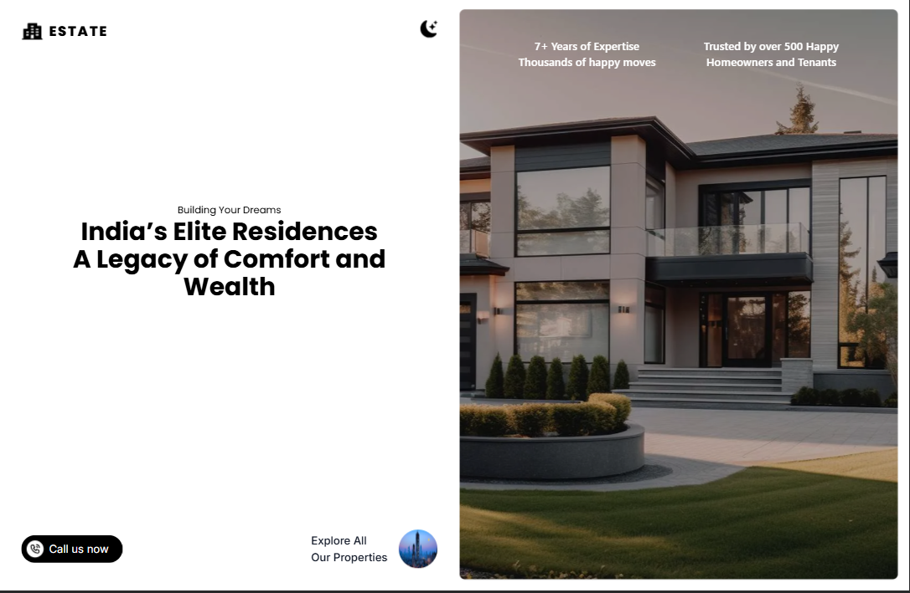
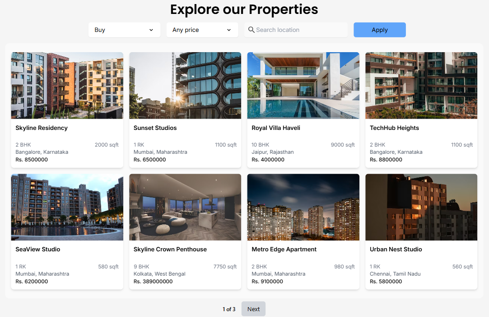
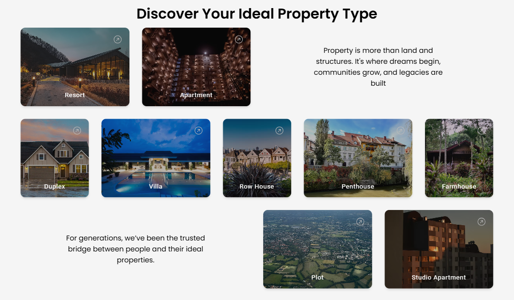
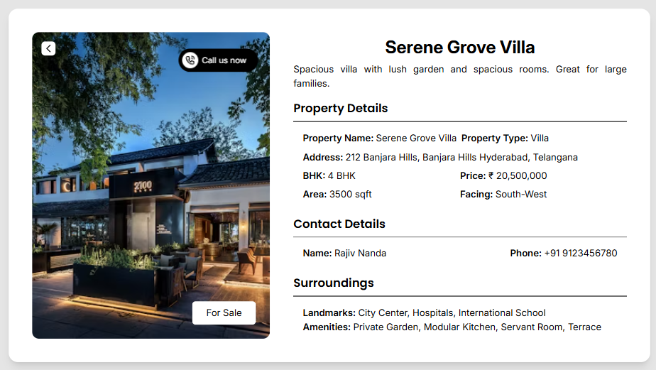

# 🏠 Real Estate Application  

The Luxury Real Estate Application is an advanced and interactive web application developed with Vite, Tailwind CSS, and React. It allows users to browse luxury properties for rent or sale, with powerful filters for property type, price, and location. The project includes animated user interface elements,  dynamic routing using react-router-dom, and effective state management using hooks such as useReducer, useState, useEffect, and React Context to maintain the global state running through the components. The application is ideal for highlighting frontend development skills in a professional and sustainable way as it accurately resemble a real-world elite real estate platform.

## 🚀 Live Site

Explore the deployed application here:  
🔗 **[https://harinipriya23.github.io/real-estate](https://harinipriya23.github.io/real-estate)**

## ✨ Explore the Experience

### 🏠 Home Page  

### 🏘️ Properties Page  

### 🏷️ Property Type Page  

### 🏡 Specific Property Page  

## 🛠️ Tech Stack

- **Frontend**: React, Tailwind CSS
- **Routing**: React Router DOM
- **State Management**: React Context, useReducer, useState, useEffect
- **Animations**: AOS (Animate On Scroll), Tailwind CSS Motion Plugins
- **Icons**: React Icons
- **Backend**: JSON Server (Mock API)
- **Language**: JavaScript

## 🛠️ Tech Stack

### 🎨 UI & Animations
- **Styling**: Tailwind CSS  
- **Motion & Effects**:  
  - Tailwind CSS Motion Plugins  
  - AOS (Animate On Scroll)  
- **UI Components**:  
  - React Icons  
  - React CountUp    
  - React Fast Marquee  
  - React Intersection Observer  

### ⚙️ Code Logic & State Management
- **Core**: React, JavaScript  
- **Routing**: React Router DOM, useNavigate 
- **State Management**:  
  - React Context  
  - useReducer  
  - useState, useEffect 
- **API Handling**: Axios  

### 🚀 Deployment & Build Tools
- **Development**: Vite  
- **Mock Backend**: JSON Server  
- **Deployment**: gh-pages (GitHub Pages)

## 🎯 Key Features

- 🔁 Reusable components for dropdowns, layout, and property types  
- ⚙️ Instant filtering using `useReducer` for search and filters  
- 🎨 Smooth UI animations with AOS and Tailwind Motion  
- 🧭 Page navigation and back action via `useNavigate`  
- 🧱 Modular layout with clean and maintainable code structure  
- 💡 Context API and `useState` for efficient state management  
- 🛣️ Client-side routing using `react-router-dom`  
- 🖼️ Brand scrolling with Marquee and FAQ accordion section  
- 📬 Integrated contact section with filter support  
- 🌐 Deployed on GitHub Pages

## Project Structure 

## 📁 Project Structure

real-estate/  
├── backend/                  # Node backend  
│   ├── db.json  
│   └── server.js  
├── frontend/                 # React frontend  
│   ├── public/  
│   └── src/  
│       ├── assets/  
│       ├── context/  
│       ├── homeComponents/  
│       ├── layoutData/  
│       ├── pages/            # Main pages  
│       ├── reducer/  
│       └── reusableComponents/
├── App.jsx  
├── index.css  
├── main.jsx  
├── screenshots/             # Project screenshots  
└── README.md  

